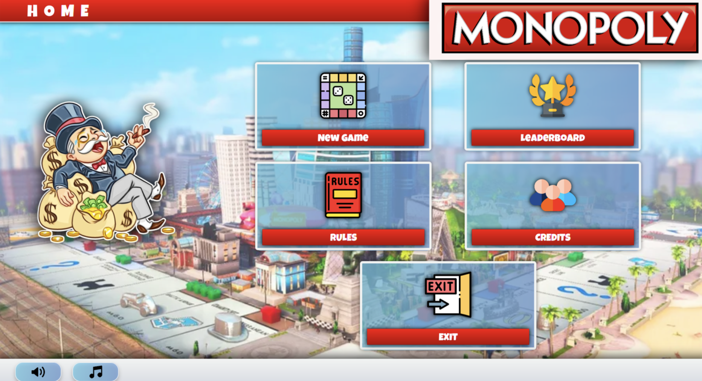
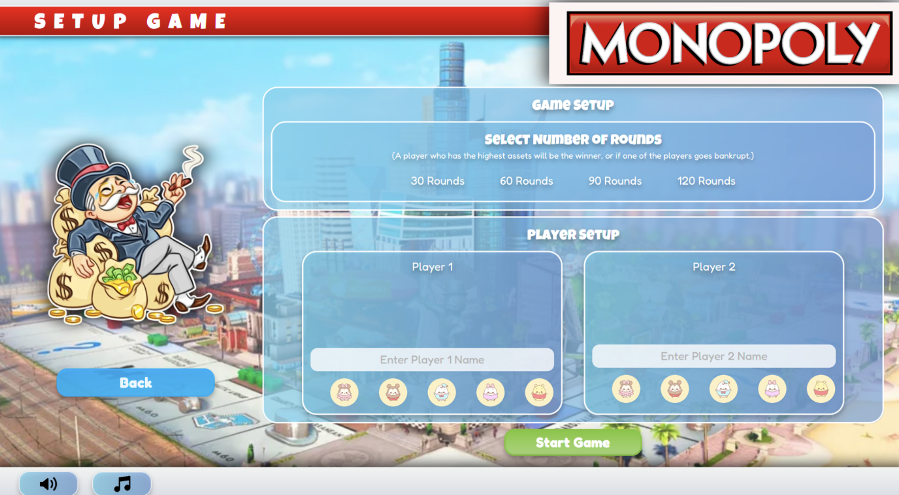
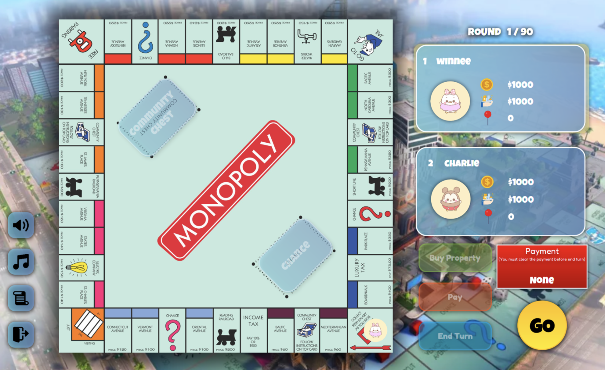

# Monopoly Scala

A classic Monopoly board game implementation built with Scala and JavaFX. This project features a complete Monopoly game with a modern GUI, database persistence, and comprehensive game mechanics.

## Program Output





## 🎮 Features

- **Complete Monopoly Gameplay**: Full implementation of classic Monopoly rules
- **Modern GUI**: Built with JavaFX and ScalaFX for a polished user experience
- **Database Integration**: Game records and leaderboard persistence using Derby/H2 databases
- **Rich Media**: Sound effects, background music, and visual animations
- **Multiple Game Elements**:
  - Properties, Railroads, and Utilities
  - Chance and Community Chest cards
  - Jail mechanics
  - Property trading and development
  - Bankruptcy detection
- **Data-Driven Design**: Game board and properties loaded from CSV files
- **Customizable Game Settings**: Player names, game rounds, and more

## 🛠️ Technology Stack

- **Language**: Scala 2.12.19
- **UI Framework**: JavaFX with ScalaFX
- **Database**: Apache Derby (embedded) and H2
- **Build Tool**: sbt
- **Data Processing**: OpenCSV for CSV file handling
- **Architecture**: MVC pattern with FXML controllers

## 📋 Prerequisites

- Java 8 or higher
- sbt (Scala Build Tool)
- Scala 2.12.19

## 🚀 Getting Started

### Installation

1. **Clone the repository**:

   ```bash
   git clone <repository-url>
   cd Monopoly-Scala
   ```

2. **Install dependencies**:

   ```bash
   sbt update
   ```

3. **Run the application**:
   ```bash
   sbt run
   ```

### Building from Source

```bash
# Compile the project
sbt compile

# Create a JAR file
sbt package

# Run tests (if available)
sbt test
```

## 🎯 How to Play

1. **Launch the game** and you'll see the main menu
2. **Click "New Game"** to start a new game
3. **Set up players**:
   - Enter player names (max 16 characters)
   - Choose number of rounds
   - Select game tokens
4. **Play the game**:
   - Roll dice to move around the board
   - Buy properties when you land on them
   - Pay rent when landing on owned properties
   - Draw Chance and Community Chest cards
   - Manage your money and properties
5. **Win the game** by being the last player standing or having the most assets after the set number of rounds

## 📁 Project Structure

```
Monopoly-Scala/
├── src/main/scala/wn/monopoly/
│   ├── MainApp.scala                 # Main application entry point
│   ├── model/                        # Game models and data structures
│   │   ├── Game.scala               # Main game logic
│   │   ├── Player.scala             # Player model
│   │   ├── Board.scala              # Game board
│   │   ├── Property.scala           # Property spaces
│   │   ├── Railroad.scala           # Railroad spaces
│   │   ├── Utility.scala            # Utility spaces
│   │   ├── Jail.scala               # Jail mechanics
│   │   ├── Card.scala               # Chance/Chest cards
│   │   └── ...                      # Other game elements
│   ├── util/                        # Utility classes
│   │   ├── Database.scala           # Database operations
│   │   ├── DataLoader.scala         # CSV data loading
│   │   ├── SceneHandler.scala       # UI scene management
│   │   ├── MultimediaHandler.scala  # Audio/visual handling
│   │   └── ...                      # Other utilities
│   └── view/                        # UI controllers
│       ├── RootPageController.scala # Main menu controller
│       ├── GamePageController.scala # Game board controller
│       └── ...                      # Other view controllers
├── src/main/resources/
│   ├── data/                        # Game data files
│   │   ├── classicMap.csv          # Board layout
│   │   ├── property.csv            # Property data
│   │   ├── railroad.csv            # Railroad data
│   │   └── ...                     # Other data files
│   ├── images/                     # Game assets
│   ├── sounds/                     # Audio files
│   └── wn/monopoly/view/           # FXML UI definitions
└── build.sbt                       # Build configuration
```

## 🎨 Game Assets

The game includes:

- **Images**: Game board, tokens, property cards, UI elements
- **Sounds**: Background music, sound effects for actions
- **Data Files**: CSV files containing game board layout and property information

## 🗄️ Database

The game uses an embedded database to store:

- Game records and statistics
- Player leaderboards
- Game history

Database tables are automatically created on first run.

## 🎮 Game Mechanics

### Core Features

- **Dice Rolling**: Two dice with animation
- **Property Management**: Buy, sell, and develop properties
- **Rent Collection**: Automatic rent calculation based on property values
- **Card System**: Chance and Community Chest cards with various effects
- **Jail System**: Players can be sent to jail and must pay to get out
- **Bankruptcy**: Automatic detection when players can't pay debts
- **Asset Tracking**: Real-time calculation of player assets

### Special Spaces

- **Go**: Collect $200 when passing or landing
- **Jail**: Temporary holding space
- **Free Parking**: Safe space with no effects
- **Tax Spaces**: Income tax and luxury tax
- **Railroads**: Special properties with different rent rules
- **Utilities**: Electric and Water companies

## 🔧 Configuration

Game settings can be modified in:

- `src/main/resources/data/` - Board layout and property data
- `src/main/scala/wn/monopoly/model/` - Game rules and mechanics
- `src/main/resources/wn/monopoly/view/` - UI layout and styling

## 🐛 Troubleshooting

### Common Issues

1. **JavaFX Runtime Error**: Ensure you have Java 8+ with JavaFX support
2. **Database Connection Issues**: The embedded database will be created automatically
3. **Missing Assets**: Ensure all image and sound files are in the correct resource directories

### Performance Tips

- Close other applications if the game runs slowly
- Ensure sufficient disk space for the embedded database
- Update Java to the latest version for best performance

## 🤝 Contributing

1. Fork the repository
2. Create a feature branch (`git checkout -b feature/amazing-feature`)
3. Commit your changes (`git commit -m 'Add some amazing feature'`)
4. Push to the branch (`git push origin feature/amazing-feature`)
5. Open a Pull Request

## 📝 License

This project is open source. Please check the license file for more details.

## 🙏 Acknowledgments

- Classic Monopoly game rules and mechanics
- ScalaFX community for JavaFX Scala bindings
- OpenCSV library for CSV file handling
- Apache Derby for embedded database functionality

## 📞 Support

If you encounter any issues or have questions, please:

1. Check the troubleshooting section above
2. Search existing issues in the repository
3. Create a new issue with detailed information about your problem

---

**Enjoy playing Monopoly Scala!** 🎲🏠💰
